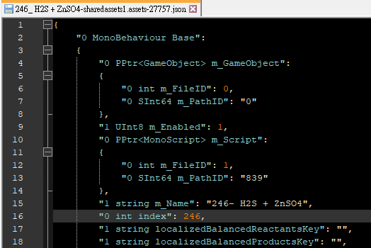
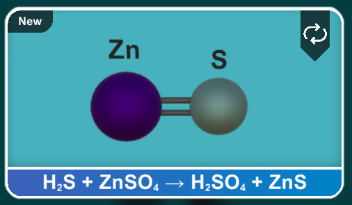

# Project Chemistry Patch

If you have already tried all combinations but still stop at 750. It is normal.

The reason that Reaction index in game are wrong.

- Dump by Bundle Extractor

- After edit

## How to use

- download the fixed version of `sharedassets1.assets`
- replace the file in `C:\Program Files (x86)\Steam\steamapps\common\Project Chemistry\Project Chemistry_Data`

## Stream Guide

- How to check what you are missing in quest mode
  [https://steamcommunity.com/sharedfiles/filedetails/?id=2998903316](https://steamcommunity.com/sharedfiles/filedetails/?id=2998903316)
